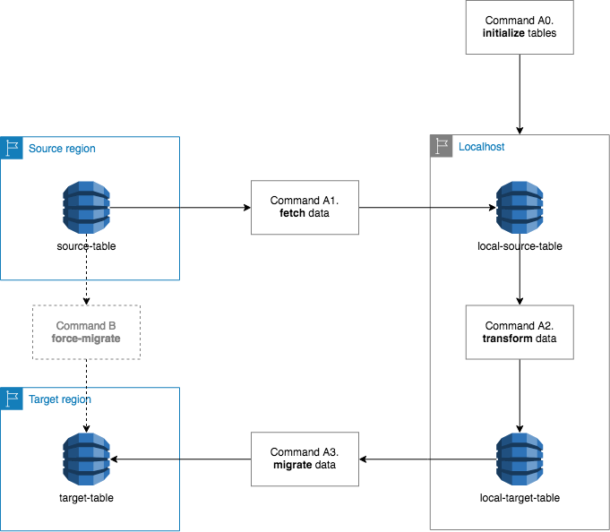

# DynamoDB Data Migrator [ddm]

A small JS CLI tool that helps with data migration from one DynamoDB table to another.

Currently AWS does not support renaming more than one index in Cloudformation stacks, meaning that the table has to be re-created every time that there are too many changes to the table schema. Similarly if a table is created with a different schema and should be preloaded with data from another table, the data should be fetched with AWS CLI, operated manually and then uploaded to the other table with the CLI. This tool skips all these steps while retaining fine-grained control to the output.

## Usage

Currently the only supported mode is the slow & safe mode that utilises a local DynamoDB instance.

The CLI tool supports four commands, that have to be run in order for the migration to work. The first command outputs a configuration file, that should be used in the subsequent commands.

The tool uses AWS profiles for credentials, so access keys are not supported for the time being.

| n | command   | from             | to     | data types                   | description                                                                     | output                    |   |   |
|---|-----------|------------------|--------|------------------------------|---------------------------------------------------------------------------------|---------------------------|---|---|
| 0 | init      | source \| target | local  | schema                       | Initialises local DynamoDB tables with schemas from AWS source & target regions | ddm.\<sourceTableName\>.yml |   |   |
| 1 | fetch     | source           | local  | items                        | Copies items from source DynamoDB table to local source DynamoDB table          | N/A                       |   |   |
| 2 | transform | local            | local  | items                        | Copies items from local source DynamoDB table to local target DynamoDB table    | N/A                       |   |   |
| 3 | migrate   | local            | target | items \| schema (optionally) | Copies items from local target DynamoDB table to target DynamoDB                | N/A                       |   |   |

Run `node ddm-{version}.js -h` for more information about possible commands.

## Features

TBA

## Requirements

The following are required for the tool to work properly:

* **Node.JS** > 10.*
* **Local DynamoDB instance** (by default port 8000, can be configured)

## License

[MIT](https://choosealicense.com/licenses/mit/)